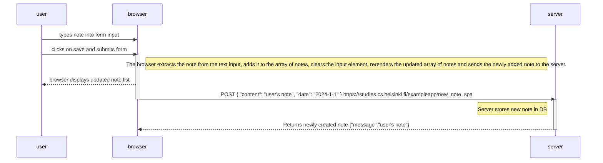

```mermaid
sequenceDiagram
    participant user
    participant browser
    participant server

    user->>browser: types note into form input
    user->>browser: clicks on save and submits form

    activate browser
    Note right of browser: The browser extracts the note from the text input, adds it to the array of notes, clears the input element, rerenders the updated array of notes and sends the newly added note to the server.

    browser-->>user: browser displays updated note list
    browser->>server: POST { "content": "user's note", "date": "2024-1-1" } https://studies.cs.helsinki.fi/exampleapp/new_note_spa
    deactivate browser

    activate server
    Note left of server: Server stores new note in DB
    server-->>browser: Returns newly created note {"message":"user's note"}
    deactivate server
```
